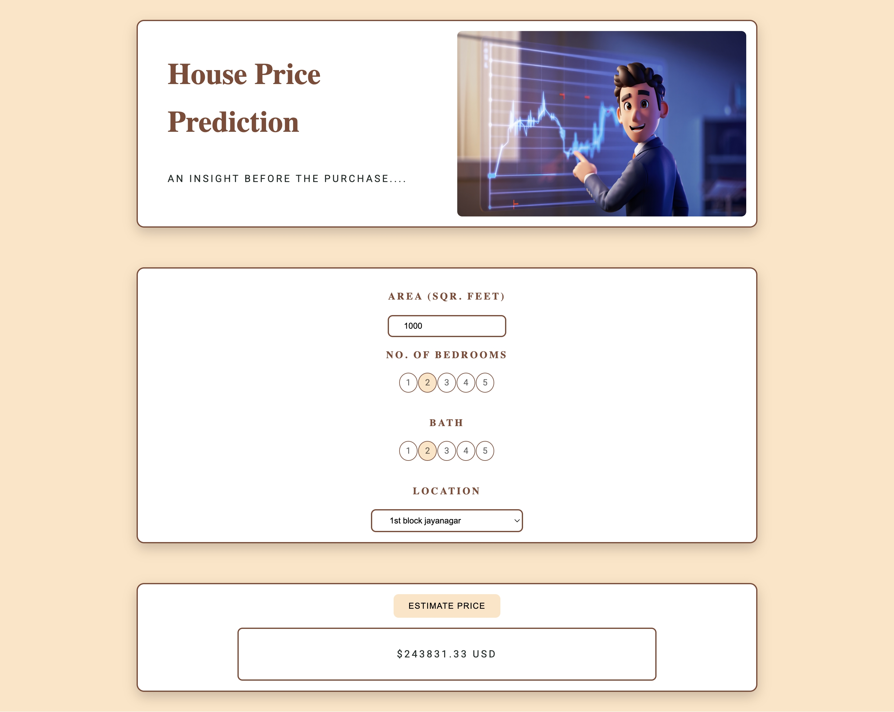

# 🏠 Housing price prediction Application

A full-stack machine learning web application that estimates property prices in Bangalore using square footage, number of bedrooms, bathrooms, and location.
link: http://ec2-13-51-176-174.eu-north-1.compute.amazonaws.com/

---

## 📌 Project Overview

This project aims to give users an estimated property price in Bangalore based on inputs they provide. It consists of:

- **Frontend**: HTML, CSS, JavaScript
- **Backend**: Python Flask API
- **Model**: Trained on cleaned real estate data and serialized as a `.pickle` file

---

## 📊 Data Preprocessing

The dataset initially had various inconsistencies and needed extensive cleaning:

- **Location Normalization**: Locations were inconsistent  We normalized them and grouped rare locations as "other".
- **Outlier Removal**:
  - Properties with abnormally high price per square foot were dropped.
  - Listings where the number of bathrooms exceeded bedrooms by 2+ were filtered out.
  - Duplicate and nonsensical entries (e.g., 240 sqft for 3 BHK) were removed.
- **Feature Engineering**:
  - `price_per_sqft` feature was created to identify outliers.
  - Final features used: `total_sqft`, `bath`, `bhk`, and `location`.

---

## 🤖 Model Training

- **Model**: Linear Regression
- **Encoding**: One-hot encoding for `location`
- **Target Variable**: Price (in Lakhs)
- The model was trained using `scikit-learn`, and performance was evaluated using `cross_val_score`.

---

## This application is deployed on an **Amazon EC2** instance and served using:

- **Gunicorn**: A production-grade WSGI HTTP server to run the Flask app.
- **Nginx**: Used as a reverse proxy to forward client requests to Gunicorn and serve static files.

